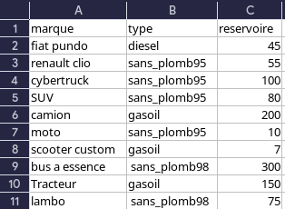

# projet station essence

## 1. les types de données

### 1.1 la gestion des type de clients

- le type de *clients* sont dans  un fichier csv qui contient les informations sur les types de clients leurs **temps** de **remplissage** et leur **particularité**

#### 1.1.1 retour sur le csv clients

- nous avons preferer utiliser les "case" pour une meilleur lisibilité du code et pour simplifier le fichier csv donc la derniere colonne est inutile avec les "case"

### 1.2 la gestion des voitures

- les *voiture* sont dans  un fichier csv qui contient les **informations** sur les voitures leurs **carburant** et leur **capacité** de remplissage

### 1.3 dans python

- nous convertissons les fichiers csv en liste avec la methode **Reader** de la librarie **CSV**

## 2. structure du code python

### 2.1 la class pompe yanis

- la pompe est une **class** qui utlisera la **class File** (vue predecament en cours ) pour combiner les informations des fichiers csv et efiler les informmations dans la  File d'attente de la station essence

#### 2.1.1 l'atribut init

- l'atribut init est la methode qui permet de definir 3 files d'attente pour les voitures puis les mettre dans une liste et executer la metthode **remplir_pompe_debut** 

### 2.2 la class essence dylan

- la class essence est une **class** qui permet de gerer les **prix** des **carburants** et les **evenements** qui peuvent se produire dans la station essence (grève , covid , braquage , ristoure de l'etat) 

### 2.3 la class client dylan

- la class Client est une **class** qui permet de gerer les **clients** et leurs **particularités** et leurs **temps** de **remplissage** 

### 2.4 la class voiture yanis

- la class voiture est une **class** qui permet de gerer les **voitures** et leurs **carburant** et leurs **capacité** de **remplissage**

### 2.5 la class station dylan

- la class Station est une class qui regroupe toutes les autres class et permet de gerer la station essence et ses **clients** , **voitures** , **pompes** , **prix** , **evenements** 

## 3 Structure du code

### 3.1 le fichier class.py

- il contient les class

### 3.2  le fichier main.py 

- il contient la boucle principale du code 
