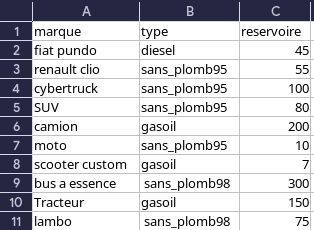

# projet station essence

## 1. les types de données

### 1.1 la gestion des type de clients

- le type de clients sont dans  un fichier csv qui contient les informations sur les types de clients leurs temps de remplissage et leur particularité

### 1.2 la gestion des voitures

- les voiture sont dans  un fichier csv qui contient les informations sur les voitures leurs carburant et leur capacité de remplissage

### 1.3 dans python

- nous convertissons les fichiers csv en liste 

